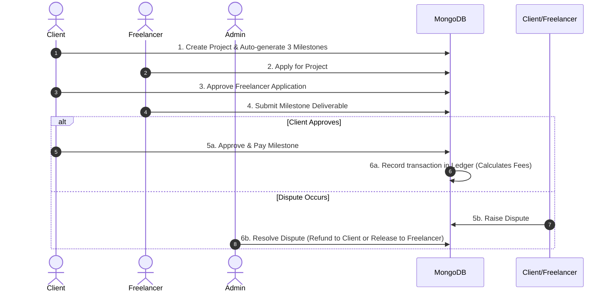

# 🤝 Freelance Escrow System

[](https://nodejs.org/)
[](https://expressjs.com/)
[](https://www.mongodb.com/)
[](https://opensource.org/licenses/MIT)

A secure, transparent, and robust full-stack web application designed to revolutionize the freelance industry. By utilizing milestone-based escrow payments, a public transaction ledger, and admin-mediated arbitration, this system ensures that clients only pay for completed work and freelancers are guaranteed payment upon successful delivery.

---

## 🚀 Key Features

*   **Role-Based Access Control (RBAC):** Customized dashboards and permissions for **Clients**, **Freelancers**, and **Admins**.
*   **Automated Escrow Milestone System:** Projects are automatically split into three milestones:
    1. *Initial Draft* (1/3 budget)
    2. *Revision & Modifications* (1/3 budget)
    3. *Final Delivery* (1/3 budget)
*   **Government ID Upload:** Secure upload pipeline for freelancers/clients using `multer` for identity verification.
*   **Milestone-Specific Workspace Chats:** Direct communication channels attached to each milestone for logging deliverables and feedback.
*   **Public Ledger system:** Real-time transaction tracking showing deposits, net earnings, and system fees (10% Client Fee, 5% Freelancer Fee) with pagination and CSV export capability.
*   **Dispute & Arbitration Flow:** Admin panel allows disputed funds to be released to the freelancer or refunded to the client.

---

## 📊 Core Escrow Workflow

The system manages the lifecycle of freelance contracts through a structured workflow:



---

## 📁 Directory Structure

```text
freelance-escrow/
├── .vscode/               # Editor configurations
│   └── settings.json
├── middleware/            # Custom Express middleware
│   ├── auth.js            # JWT verification & User extraction
│   └── error.js           # Global express error handler
├── models/                # Mongoose database models
│   ├── User.js            # User accounts, authentication & profiles
│   ├── Project.js         # Projects, milestones, deliverables & chats
│   ├── Dispute.js         # Milestone arbitration cases
│   └── Ledger.js          # Financial bookkeeping transactions
├── public/                # Frontend Single Page App (SPA)
│   ├── assets/            # Empty folder for assets/media
│   ├── css/
│   │   └── styles.css     # Responsive custom UI stylesheets
│   ├── js/
│   │   ├── app.js         # Simple hash router and API wrapper
│   │   ├── auth.js        # Signup, login & Terms of Service logic
│   │   ├── chat.js        # Milestone chat handlers
│   │   ├── dashboard.js   # Client, Freelancer, Admin dashboard views
│   │   └── utils.js       # Toast notifications & formatting utils
│   └── index.html         # Main app markup structure
├── routes/                # Backend API route handlers
│   ├── admin.js           # Admin management, approval & disputes
│   ├── auth.js            # Auth endpoints (signup, login)
│   ├── chat.js            # Milestone messaging routes
│   ├── ledger.js          # Financial bookkeeping & CSV export
│   ├── milestones.js      # Milestone submissions & actions
│   └── projects.js        # Project CRUD & application management
├── .env                   # Environment variable declarations (ignored)
├── package.json           # Node project details and dependencies
├── server.js              # Application entry point
└── setup.js               # Scaffold directories and placeholders
```

---

## 💾 Database Schemas (Mongoose)

### 1. User
Stores user accounts and metadata.
*   `name`: (String, Required) - User's full name.
*   `email`: (String, Required, Unique) - Contact and login email.
*   `password`: (String, Required) - Bcrypt hashed password.
*   `role`: (String, Enum: `client`, `freelancer`, `admin`) - Account access level.
*   `signedTac`: (Boolean, Default: `false`) - Accepted system terms & conditions.
*   `profile`: Object - Contains `domain`, `exp`, `bio`, `skills`, and `govId` (path to uploaded ID).

### 2. Project & Milestones
Tracks job details and specific milestones.
*   `title`, `type`, `desc`: Details of the job request.
*   `deadline`: Project timeline target.
*   `amount`: Total budget amount.
*   `clientEmail`: Creator's email identifier.
*   `selectedBy`: Associated freelancer's email.
*   `applicants`: Array of freelancer applications.
*   `milestones`: Nested sub-document array:
    *   `name`, `amount`, `deliverable`.
    *   Status flags: `submitted`, `approved`, `paid`, `refunded`.
    *   `chat`: Embedded array of milestone comments (`by`, `text`, `ts`).

### 3. Ledger
Financial audit trail for transaction records.
*   `ts`: Date/time of transaction.
*   `project`: Associated project name.
*   `milestone`: Associated milestone name.
*   `total`: Base milestone payout.
*   `clientFee`: 10% fee charged to the client.
*   `freelancerFee`: 5% fee deducted from freelancer.
*   `net`: Net amount released to freelancer (Total - 5%).

### 4. Dispute
Resolution tickets for milestone conflicts.
*   `projectId`, `milestoneId`: Associated contract anchors.
*   `byEmail`: Email of the user who disputed.
*   `reason`: Text describing the disagreement.
*   `status`: (Enum: `open`, `resolved`).
*   `result`: (Enum: `Refund to Client`, `Release to Freelancer`).

---

## 🔌 API Endpoints Reference

### Authentication (`/api/auth`)
| Method | Endpoint | Auth Required | Description |
| :--- | :--- | :---: | :--- |
| `POST` | `/signup` | No | Registers a new User (hashes password, signs JWT) |
| `POST` | `/login` | No | Validates email & password, returns JWT |

### Projects (`/api/projects`)
| Method | Endpoint | Auth Required | Description |
| :--- | :--- | :---: | :--- |
| `POST` | `/` | Yes (Client) | Creates a project and auto-splits budget into 3 milestones |
| `GET` | `/` | Yes | Retrieves filtered projects based on role |

### Milestones (`/api/milestones`)
| Method | Endpoint | Auth Required | Description |
| :--- | :--- | :---: | :--- |
| `POST` | `/:projectId/:milestoneId/submit` | Yes (Freelancer) | Submits deliverables and updates milestone status |

### Workspace Chat (`/api/chat`)
| Method | Endpoint | Auth Required | Description |
| :--- | :--- | :---: | :--- |
| `POST` | `/:projectId/:milestoneId` | Yes | Posts a chat message to a milestone discussion board |
| `GET` | `/:projectId/:milestoneId` | Yes | Fetches all chat messages within a milestone |

### Financial Ledger (`/api/ledger`)
| Method | Endpoint | Auth Required | Description |
| :--- | :--- | :---: | :--- |
| `GET` | `/` | Yes | Returns paginated list of ledger entries (sorted by newest) |
| `POST` | `/` | Yes | Creates a ledger record on successful milestone payment |
| `POST` | `/clear` | Yes (Admin) | Deletes all ledger entry history |
| `GET` | `/export` | Yes | Exports the ledger database table to a CSV file |

### Admin Dashboard (`/api/admin`)
| Method | Endpoint | Auth Required | Description |
| :--- | :--- | :---: | :--- |
| `GET` | `/users` | Yes (Admin) | Lists all registered users (excluding passwords) |
| `GET` | `/projects` | Yes (Admin) | Overview of projects showing only the latest milestone state |
| `GET` | `/pending-milestones` | Yes (Admin) | Lists milestones pending review and approval |
| `POST` | `/approve-milestone/:projectId/:milestoneId` | Yes (Admin) | Approves a milestone delivery |
| `GET` | `/disputes` | Yes (Admin) | Returns all open/closed disputes |
| `POST` | `/resolve-dispute/:disputeId` | Yes (Admin) | Resolves dispute: releases funds to freelancer or refunds client |

---

## 🛠️ Getting Started & Installation

### Prerequisites
*   [Node.js](https://nodejs.org/) (v16.0.0 or higher)
*   [MongoDB](https://www.mongodb.com/) (Local installation or MongoDB Atlas cluster URI)

### Setup Steps
1.  **Configure Environment Variables:**
    Create a `.env` file in the root of the `freelance-escrow/` folder (or edit the existing one):
    ```env
    PORT=3000
    MONGO_URI=mongodb://localhost:27017/freelance_escrow
    JWT_SECRET=your_super_secret_key_here_change_me
    ```
2.  **Install Backend Dependencies:**
    Navigate to the source code folder and install:
    ```bash
    cd freelance-escrow
    npm install
    ```
3.  **Run Scaffold Script (Optional):**
    If folders are missing, run the initialization script:
    ```bash
    node setup.js
    ```
4.  **Start the Server:**
    *   **Development Mode (Nodemon):**
        ```bash
        npm run dev
        ```
    *   **Production Mode:**
        ```bash
        npm start
        ```
5.  **Access the Application:**
    Open your browser and navigate to `http://localhost:3000`.

---

> [!IMPORTANT]
> Make sure your MongoDB service is running locally (`net start MongoDB` or `mongod`) or update the `MONGO_URI` in `.env` before starting the application.

> [!NOTE]
> The database name `freelance_escrow` is automatically created on your first MongoDB transaction connection.

---
